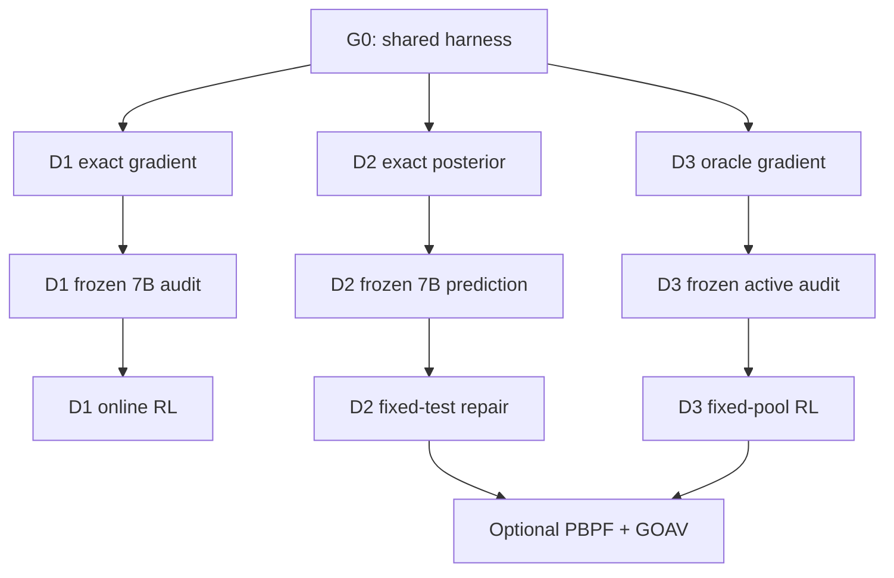

# Execution roadmap and go/stop decisions

The purpose of this roadmap is to prevent a long 7B run from becoming the first time an estimator or posterior is tested. Each gate answers one scientific question and has an explicit stop outcome.

## 1. Dependency graph



Only arrows authorize progression. In particular, a good PBPF predictor does not authorize active test selection, and a good GOAV selector does not establish that particle beliefs are necessary.

## 2. G0 — common infrastructure acceptance

Complete before comparing any method:

- immutable train/dev/mechanism manifests plus an evaluator-held HMAC/escrow manifest for sealed tasks;
- deterministic container image and resource limits;
- vector-valued per-test outcome API;
- token, execution and optimization ledgers from `00_shared_protocol.md`;
- replayable candidate/test bank;
- task-level bootstrap and seed aggregation;
- duplicate and leakage checks;
- exact-gradient hooks for registered LoRA blocks;
- crash/timeout classification separated from semantic failure.

Acceptance tests:

- rerunning 100 cached program-test pairs gives identical outcomes;
- cache keys change when code, test, compiler, dependency or limit changes;
- 1,000 ledger events reconcile to aggregate totals exactly;
- deliberately leaked test IDs are caught by the loader;
- candidate permutations leave group metrics invariant.

## 3. Parallel mechanism sprint

Run the three Phase 0 experiments independently. They are cheap enough to pursue in parallel and share no learned state.

| Direction | Primary falsification | Required result to continue | Stop result |
|---|---|---|---|
| D1 JAG | recursive estimator/allocation does not reduce gradient error | ≥25% gradient-MSE/token reduction, <1% bias and valid coverage | oracle/reference advantage absent |
| D2 PBPF | multimodal posterior adds no future prediction | exact posterior and particles pass NLL/calibration gates | exact posterior no better than single state |
| D3 GOAV | gradient-risk acquisition does not beat generic uncertainty | ≥20% gradient-MSE reduction at 5–10% audits | oracle selector no better than random/entropy |

Use three seeds, but inspect failures only after all preregistered runs finish. Bugs invalidate runs; unattractive scientific results do not.

## 4. Phase 1 frozen-model decision

For every surviving direction:

1. generate one frozen Qwen2.5-Coder-7B candidate bank;
2. share candidates with all arms in that direction;
3. train only the small estimator/controller modules;
4. run exact or full-information audits on the held-out mechanism set;
5. verify the claimed intermediary metric before measuring downstream pass rate.

Rank directions with the following rubric:

| Criterion | Weight | D1 evidence | D2 evidence | D3 evidence |
|---|---:|---|---|---|
| mechanism effect size | 30% | gradient MSE/token | future NLL/calibration | gradient MSE/audit cost |
| survives strongest baseline | 25% | uniform/entropy/value tree | matched deterministic state | random/entropy AIPW |
| estimator validity | 20% | exact-gradient bias/coverage | exact-posterior KL/coverage | AIPW bias/OPE coverage |
| systems feasibility | 15% | branch/cache utilization | particle/cache memory | sandbox throughput/ESS |
| distinct paper claim | 10% | genealogy credit/allocation | predictive multimodal state | gradient-aware acquisition |

Advance at most two directions. The default recommendation is D1 as the lowest-dependency main line; D2 or D3 advances only on its measured score, not because they combine attractively.

## 5. Phase 2 online-RL sequence

For each selected direction:

1. **1.5B plumbing run:** 20–50 updates, no performance claim.
2. **7B 1% calibration:** estimate cost and failure modes.
3. **7B screening:** baseline plus method, one seed, 200 updates.
4. **Decision audit:** rerun direction-specific mechanism metrics on the changed policy.
5. **Formal run:** strongest baseline and method, three seeds—D1 600–800, PBPF 600–1,000, GOAV 800–1,200 updates.
6. **Key ablations:** only those needed to identify the causal component.
7. **Architecture replication:** Qwen3-8B on the primary comparison if 7B succeeds.
8. **Locked evaluation:** one registered query per selected checkpoint/primary baseline.

Do not use a failed screening seed to select a new test set, reward normalization or primary metric. Changes create a new experiment version and repeat the screening stage.

## 6. Combining Directions 2 and 3

The combined system is justified only if all four conditions hold:

- PBPF predicts future fixed-test outcomes better than the best single state;
- PBPF improves fixed-order repair;
- GOAV improves trusted-gradient MSE with a non-PBPF belief model;
- GOAV's AIPW/OPE coverage diagnostics pass.

Then run a 2×2 factorial experiment:

| Belief / Acquisition | Random fixed-order | GOAV |
|---|---:|---:|
| deterministic single state | control | D3 |
| PBPF particles | D2 | combined |

This identifies main effects and interaction. Match trusted-audit budget and tokens. A combined paper needs a positive interaction or a clear division of labor; merely adding the two independent gains is not a new claim.

Learned test content is a second factorial extension only after the fixed-pool 2×2 result. It is never used to rescue a failed fixed-pool acquisition objective.

## 7. Experiment identity and branch policy

Use one immutable ID:

```text
{direction}-{phase}-{dataset_manifest8}-{model}-{seed}-{config_sha8}
```

Recommended implementation branches:

- `infra/shared-harness`
- `research/jag-tree-phase0`
- `research/pbpf-phase0`
- `research/goav-phase0`
- later `research/<direction>-7b`

Each merge requires estimator unit tests, a 100-task smoke artifact and a config diff. Results are stored separately from source code; summaries name the exact commit, container digest and manifest hash.

## 8. Minimum result tables

Every direction produces three tables:

1. **Validity:** bias, variance/MSE, calibration/coverage and invariants.
2. **Efficiency:** task quality against tokens, execution CPU-seconds and wall time.
3. **Learning:** validation and locked pass@1, individual seeds and confidence intervals.

Plots must include the full budget frontier. A single operating point can hide that a method merely spends more branches, particles or tests.

## 9. Decision outcomes

| Outcome | Meaning | Deliverable |
|---|---|---|
| Phase 0 fails | foundational mathematical assumption false in controlled setting | negative mechanism report; no 7B spend |
| Phase 0 passes, Phase 1 fails | approximation/representation does not transfer | exact-vs-learned diagnosis |
| Phase 1 passes, Phase 2 fails | local mechanism does not improve learning dynamics | estimator/prediction paper only if effect is strong |
| Online succeeds, locked fails | overfit or contamination | no generalization claim |
| Locked succeeds with mechanism intact | full paper claim supported | replicate on Qwen3-8B and one task family |

## 10. First concrete work package

The first implementation milestone should contain only:

1. shared vector-outcome schema and ledgers;
2. JAG finite-MDP exact-gradient notebook/test;
3. PBPF finite-DSL posterior enumerator/test;
4. GOAV synthetic noise and AIPW gradient audit/test;
5. one command per Phase 0 configuration;
6. a report generator that refuses to label an experiment “passed” unless every registered gate is present.

This package decides which expensive system is worth building; it should not contain 7B online training yet.
